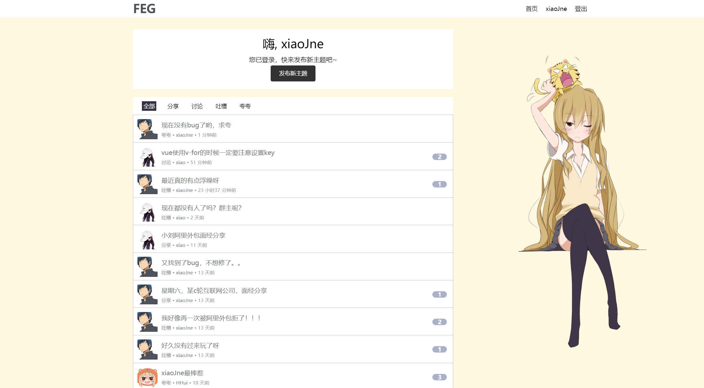
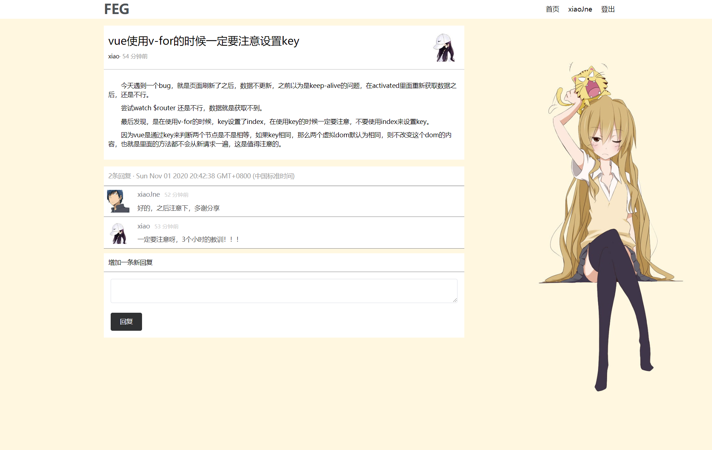

# 基于express和vue的论坛系统
:musical_keyboard: 基于 express + Vue(2.6) + vuex + vue-router + axios + Scss + ES6 等开发一个简单论坛，UI 界面参考了v2ex

:yum: 项目演示地址：[Simple-BBS](http://139.196.203.58:8081/home)

## 预览

#### 主页，全部的帖子



#### 帖子详情和评论


#### 技术栈

**前端**

* `Vue`：用于构建用户界面的 MVVM 框架
* `vue-router`：为单页面应用提供的路由系统
* `vuex`：Vue 集中状态管理，用来保存登录状态和登录的用户信息，便于多个组件共享
* `Element`:Vue组件库,使用了部分组件
* `SCSS`：css 预编译处理器
* `axios`：用于请求后端数据
* `ES6`：ECMAScript 新一代语法，模块化、解构赋值、Promise、Class 等方法非常好用

**后端**

* `Express`：基于Node.js平台的Web开发框架，本项目使用Express进行后端的开发
* `Multer`：node.js中间件，用于处理multipart/form-data类型的表单数据，本项目中主要用于上传文件
* `bcrypt`: 密码加密
* `cookie-parser`:解析cookie


**其他工具**

* `sqllite`: 用于连接和操作sqllite数据库
* `vue-cli`：Vue 脚手架工具，快速初始化项目代码
* `eslint`：代码风格检查工具，帮助我们规范代码书写（一定要养成良好的代码规范）
* `prettier` ：自动格式化代码

## 目标功能

- [x] 注册
- [x] 登录
- [x] 发布新主题
- [x] 增加评论
- [x] 头像上传
- [ ] 帖子分类
- [ ] 帖子顶置
- [ ] 帖子分页
- [ ] 删除帖子
- [ ] 修改帖子
- [ ] 支持markdown

## 最后

如果觉得我的项目还不错的话 :clap:，就给个 star :star: 鼓励一下吧~

## Build Setup
```bash
# install dependencies
npm install

# serve with hot reload at localhost:8080
npm run serve

# build for production with minification
npm run build
```
